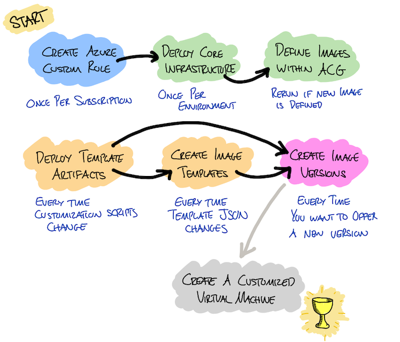

# Custom VM Sample Toolkit

[![OSS Status: Sample][sample-badge]][sample-markdown]

Welcome! Once upon a time I was tasked with using Azure VM Image Builder and Azure Compute Gallery to define, publish, and then use Custom VM templates in Azure. After reading the help documentation on these services, and following along with the tutorials, I wrote a set up bash scripts, and orchestrated them with some Make targets, that automated the workflow of setup and publishing of VM image templates in Azure. 

This repository contains those scripts and the Makefile, and some notes on how they might be used to automate the Custom VM workflow. These scripts made my life a little easier, and they might be useful to others.

## WARNING: This Repository contains SAMPLE CODE

- **Do not use this in a production environment**
- **This repository is a sample only**.  There's no assurance that this code will work, work correctly, or that it'll work for you in your setup/environment.
- The scripts in this repository create, update, and delete Azure resources. You should review this code before considering running it anywhere.
- This repository is not actively maintained.
- The scripts in this repository have not been extensively tested.
  
If you find issues, or have suggestions, please feel free to raise these as GitHub issues, or even open PRs. 

**HOWEVER** there's no guarentee that these will be actioned. 

The best thing you can do is fork this repo, or copy/download the code, and make your own modifications in your own copy. The code in this repo is released under the MIT license "as is" (see `LICENSE` for details).

## Essential Background Reading

There are a number of documents that describe what Custom VM image template are, how to create them, and how to use them. There are samples and tutorials that take you through the process of creating Azure resources, defining VM templates, and using the various CLI commands to build and then use Custom VM images in Azure. I've listed some of the ones I think are useful below.

**Please read these docs**. Go on. Grab a cup of your favourite drink and spend 30 mins reading these docs. 

The scripts in this repo make it easier to set up a Custom VM environment, but you're going to want to understand the core concepts, and you'll probably want to understand Azure CLI commands in detail so that you can maintain or modify the scripts. 

**Future you will thank you** if you spend some time getting to know Azure VM Image Builder, Azure Compute Gallery, and how these services are used.

- [Azure VM Image Builder overview
](https://docs.microsoft.com/en-us/azure/virtual-machines/image-builder-overview?tabs=azure-cli)
- [Azure Image Builder Quickstarts - GitHub](https://github.com/azure/azvmimagebuilder)
- [Create a Linux image and distribute it to an Azure Compute Gallery](https://docs.microsoft.com/en-us/azure/virtual-machines/linux/image-builder-gallery)
- [Create a Windows image and distribute it to an Azure Compute Gallery](https://docs.microsoft.com/en-us/azure/virtual-machines/windows/image-builder-gallery)
- [Example VM Image Template](https://github.com/Azure/azvmimagebuilder/blob/main/quickquickstarts/1_Creating_a_Custom_Linux_Shared_Image_Gallery_Image/helloImageTemplateforSIG.json)
- [Sharing Images in an Azure Gompute Gallery](https://docs.microsoft.com/en-us/azure/virtual-machines/shared-image-galleries?tabs=azure-cli#sharing)
- [Copy Azure Compute Gallery Image Versions between Azure Clouds, Tenants, and Subscriptions](https://techcommunity.microsoft.com/t5/fasttrack-for-azure/copy-azure-compute-gallery-image-versions-between-azure-clouds/ba-p/3373145)
- [Azure VM Image Builder networking options](https://docs.microsoft.com/en-us/azure/virtual-machines/linux/image-builder-networking)

## Some Core Concepts

Having read the docs above (you did read them, right?) you should now be familiar with the following concepts, and the reasons why any of these scripts exist...

### Why?

When you create a Virtual Machine (VM) in Azure you select an image to base it on.

For example, you might deploy a Windows Server VM, or a Ubuntu Linux VM.

These images are pretty basic and don't include many pre-installed tools. In an organisation/team you might want to create VM images that include all your commonly used software.

This is where **Azure Image Builder** and **Azure Compute Gallery** come into the picture

### What?

- **Azure Image Builder** is a service, in Azure, that will create Generalized Image Builds. 
  - It takes an image template (JSON), and customization scripts (bash, Powershell etc), and creates disk images that can be used when provisioning a VM

- **Azure Compute Gallery** is a service that helps you manage and publish the generalized image builds created by Azure Image Builder.

### The Components

- **Azure Compute Gallery (ACG)** provides a way of advertising custom VM definitions.
  - Think of ACG as a menu in a restaurant
-Within ACG we create **Image Definitions**
  - **Image Definitions** are the listings of meals on the menu
- For each Image Definition, we define an **Image Templates**
  - **Image Templates** are the recipes for creating the meals on the menu
- From an Image Template we then build **Image Versions**
  - **Image Versions** are pre-prepared meals, created from the ingredients you had available at the time
  - **Azure Image Builder** is the kitchen in which these pre-prepared meals are cooked

- From an **Image Version** we can deploy a **Virtual Machine**
  - Think of these as the final meal, delivered to the customer 

### The Process

The following (bad) diagram tries to show that there are a number of steps that you need to take in order to go from "zero" to "having customised VMs deployed".

- Some of these steps are one-off setup steps, such as creating an Azure Custom Role
- Some of these steps need to happen once-per-environment
- Some happen once-per-custom-VM-template
- Some happen every time you update your VM customisations



## Folder Structure

OK. So, now that you know what we're trying to acheive, let's look at what you'll find in this repo...

```
.
├── Makefile                      # Makefile used to drive all scripts and automation
├── README.md                     # This README document
├── roles                         # Folder containing custom Azure role defintions
├── scripts                       # Folder containing bash scripts and environment settings
│   └── environments              # Folder containing environment settings
├── templates                     # Folder containing Custom VM templates and scripts
├── utils                         # Scripts and utilities
└── .devcontainer                 # The VS Code devcontainer definition
```

## VS Code and Dev Containers

If you open this project in Visual Studio Code, and have the Dev Container extension installed, then life will be good.

You'll be able open this project and have a Debian container that has all of the tools (Azure CLI, AzCopy, bash completion etc) installed for you, and the scripts and Makefile targets will function.

If you *don't* use VS Code/Dev Containers, you're on your own. Good luck! 

## `Makefile` Targets

Everything is driven by the `Makefile` in the root of this repo, and the Make targets it contains.

The `Makefile` has the following help text, which you can see if you run `make help` from the command line:

``` bash
$ make help

help                            Show this help
vm-show-env                     show the environment variables associated with custom VM images
vm-create-role                  creates the custom role defintion (run once per subscription)
vm-view-role                    views the custom role defintion
vm-deploy-core                  deploy core infra required for custom VMs (run once per environment)
vm-define-basic-linux-image     create basic linux image definitions within Azure Compute Gallery
vm-deploy-template-artifacts    copy VM templates and supporting scripts to storage in Azure (run when templates are updated)
vm-create-basic-linux-template  create the basic linux template in Azure (run once per template)
vm-build-basic-linux-image      builds the basic Linux VM image
```

> Note: The dev container has bash completion for `make` set up so you can type `make vm-c` and then hit `TAB` to complete this command, or to list the possible options that match.

These make targets are presented in the order that you will generally run them.

## Environments

You often end up setting things up in multiple environments, and need different configuration or environment variables for each environment. For example, you might have an Azure subscription to do your development in, and then a different Azure subscription for Testing, and another for Production.

To facilitate this, the scripts in this repo use configuration read from environment files.

### Environment Set up

Before running the `Makefile` targets you need to define environment variables for your environment.

For a developer, in a local development loop (e.g. editing the customisation scripts, and testing they work) you will want to take a copy of `scripts\environments\local.env.example` and save it into the same folder as `local.env`. Then, edit this file to set values for each of the environment variables that does not otherwise have a value already set.

The following is an example of how your `local.env` might look once populated with values:

``` bash
# Environment (used in naming of image definitions)
# Suggestion: replace Test01 with your email alias or something unique to you
#             e.g. Bob01
export CVM_ENVIRONMENT_SUFFIX=Test01

# Resource group and location of Azure Compute Gallery
export CVM_RESOURCE_GROUP=sample-customvm01
export CVM_LOCATION=uksouth
export CVM_GALLERY_NAME=sample_gallery_01

# Storage Account for VM Image Templates
export CVM_STORAGE_ACCOUNT=samplecmvmsto01
export CVM_CONTAINER_NAME=custom-vm-assets

# Managed Identity
export CVM_IMAGE_BUILDER_ID_NAME=sampleimgbldID01

# Custom Role Definition
export CVM_IMAGE_BUILDER_ROLE_NAME="Azure Image Builder Service Image Creation Role (Dev)"
```

The `CVM_ENVIRONMENT_SUFFIX` variable is worth calling out. This prevents you from name-clashing with the Development and Production infrastructure. This suffix is added to the end of the name for Azure resources. You should define a `CVM_ENVIRONMENT_SUFFIX` value that is unique to you. This will then be appended to the image template names, offer names, and image defintion names that you generate. 

### Named Environments

Within the `vm-images/scripts/environments` folder you will see named environment .env files:

| file               | description |
| ----               | ------------|
| `test.env`  | Contains the environment variables for a TEST subscription |
| `production.env`   | Contains the environemnt variables for a PROD subscription |

These files are committed to git, and then used when you deploy that environment.
 
## Usage

So, how do you use any of this stuff?

Well, there are main 5 activities that the `Makefile` and associated scripts support. These are:

1. Setting up the Infrastructure for Custom VM Builds
2. Defining an Image in Compute Gallery
3. Deploying Customisation Scripts to a Storage Account
4. Creating Image Templates
5. Building an Image Version

Each of these activities are described in more detail below.

### Some Assumptions

- You have an Azure Subscription
- You have permission in that Azure Subscription to do stuff, such as create resources. This has only been tested in a subscription where I have owner permissions.
- You have logged in to that Azure Subscripion using `az login`
- You've read the docs I mentioned previously
- You're read the warning at the top of this file

### Activity 1 - Setting up the Infrastructure for Custom VM Builds

In order for Azure Image Builder to be able to access the resources you deploy, it needs to make use of a custom Azure role.

Use `make vm-view-role` to view details about the deployed Azure custom role. Running this target will determine if it's appropriate to run `make vm-create-role` for this subscription. If this target returns details there's no need to run `make vm-create-role`.

Use `make vm-create-role` to create a custom Azure role. You should do this **once per subscription**. Once you have run this once in a given subscription you will **never need to run it again**. Running it a second time won't break anything, but will return an error.

Assuming you've created the Azure custom role, you should now deploy the core infrastructure.

Use `make vm-deploy-core` to deploy the Resource Group, a Storage Account, an Azure Compute Gallery, and a Managed Identity. You should do this **once per environment** where an environment might be TEST, PROD, or a personal developer environment.

At this point, you now have the infrastructure in place to support the defintion of VM images, templates, and building VM image versions and publishing them to an Azure Compute Gallery.

### Activity 2 - Defining an Image in Compute Gallery

An image defintion, within Azure Compute Gallery, is essentially like a catalog entry; it's a way of advertising a type of image, allowing it to be discoverable.

There is a make target for each image definition. At this point, there is only one image definition but you should create additional make targets as you add more image defintions:

```
make vm-define-basic-linux-image
```

Use these targets to create the image definitions for the your VM image defintions within your Azure Compute Gallery. This **only needs to be run once**

### Activity 3 - Deploying Customisation Scripts to a Storage Account

When Azure Image Builder builds an Image Template (the next step) is will need to access the customisation scripts (bash or Powershell scripts). In order for this to work these scripts need to be hosted somewhere.

Use `make vm-deploy-template-artifacts` to copy these files to the storage account that was set up during Activity 1. This **only needs to be run if the customisation scripts are changed**.

### Activity 4 - Creating Image Templates

An Image Template is generated from the `image_template.json` files within this folder structure. These Image Templates tell Azure Image Builder how to build and then customize an Image Version. Each time you want to create a new Image Version you will use an Image Template.

There is a make target for each image template. At this point, there is only one image definition but you should create additional make targets as you add more image templates:

```
make vm-create-basic-linux-template
```

You should run these targets if you need to change your image templates in some way.

### Activity 5 - Building an Image Version

Finally, an Image Version is build by running the Image Template. This causes Image Builder to take the base OS image (specified in the template), apply the customisations (specified in the template), and to publish the output to an Azure Compute Gallery. At the end of this process you will have an Image Version.

There is a make target for each image version. At this point, there is only one image definition but you should create additional make targets as you add more image versions:

```
make vm-build-basic-linux-image
```

You should run these targets each time you want to generate a new Image Version. This might include building new versions to capture changes in the base OS image (e.g. patches), or capturing any changes in the customization scripts.

> Note: this step can take a very long time. The basic linux image takes around 20 mins. The other images take up to an hour, or longer, to complete.

## Templates Folder

The `templates` folder contains one folder per customized VM definition. The structre of this folder is currently (at time of writing) as follows:

```
.
└── basic-linux
    ├── image_metadata.txt
    ├── image_template.json
    └── scripts
        └── init_vm.sh
```

Create additional subfolders for each custom VM template that you wish to define. At present, this folder contains just ONE template, the "basic-linux" template which has almost no customisation at all.

Within each subfolder you can find the following types of files:

Each folder contains an `image_template.json` file. This is the template that is delivered to Azure Image Builder and defines the way in which a base VM image will be customised.

The following link contains a reference for these files: https://learn.microsoft.com/en-us/azure/virtual-machines/linux/image-builder-json?tabs=json%2Cazure-powershell

Optionally, each folder also contains a `scripts` subfolder, and one or more scripts (Bash, Powershell, or otherwise). These scripts are referenced by the `image_template.json` file, and are accessed and run during the Azure Image Builder steps. 

Finally, each folder contains an `image_metadata.txt`. This file contains name/value pairs that are used by the Custom VM scripts. It is important that each folder contains one of these metadata files, and that the file follows the same format as follows:

``` ini
IMAGE_DEFINITION_PREFIX=IMAGE_DEFINITION_PREFIX_HERE
TEMPLATE_NAME_PREFIX=TEMPLATE_NAME_PREFIX_HERE
OFFER_PREFIX=OFFER_PREFIX_HERE
PUBLISHER_NAME=PUBLISHER_NAME_HERE
SKU=SKU_HERE
OSTYPE=OSTYPE_HERE
```

For example:

```ini
IMAGE_DEFINITION_PREFIX=SAMPLEBasicLinuxImage
TEMPLATE_NAME_PREFIX=SAMPLEBasicLinuxVM
OFFER_PREFIX=SAMPLEBasicLinuxVM
PUBLISHER_NAME=SAMPLE
SKU=18.04-LTS
OSTYPE=Linux
```


Property | Usage | 
---|---
IMAGE_DEFINITION_PREFIX| Used as a prefix for the image defintion within Azure Compute Gallery. Suffix is the `CVM_ENVIRONMENT_SUFFIX` value from the environment `.env` file. e.g. `SAMPLEBasicLinuxImage` prefix might be combined with `Test01` to become `SAMPLEBasicLinuxImageTest01`
TEMPLATE_NAME_PREFIX| Used as a prefix for the template name within Azure Compute Gallery. Suffix is the `CVM_ENVIRONMENT_SUFFIX` value from the environment `.env` file. e.g. `SAMPLEBasicLinuxVM` prefix might be combined with `Test01` to become `SAMPLEBasicLinuxVMDev`SAMPLEBasicLinuxVM
OFFER_PREFIX| SAMPLEBasicLinuxVM
PUBLISHER_NAME| The publisher name used when publishing the image in Azure Compute Gallery. e.g. `SAMPLE`
SKU| The SKU used when publishing the image in Azure Compute Gallery. e.g. `18.04-LTS`
OSTYPE| The OS type used when publishing the image in Azure Compute Gallery. Can be either `Linux` or `Windows`

## Finally

Once an Image Version has been build it is possible to create VMs based upon that Image Version. This can be done within the portal, or via the Azure CLI.

[sample-badge]: https://img.shields.io/badge/OSS%20Status-Sample-orange.svg
[sample-markdown]: https://github.com/martinpeck/oss-project-status/blob/master/sample/OSS_STATUS.md
